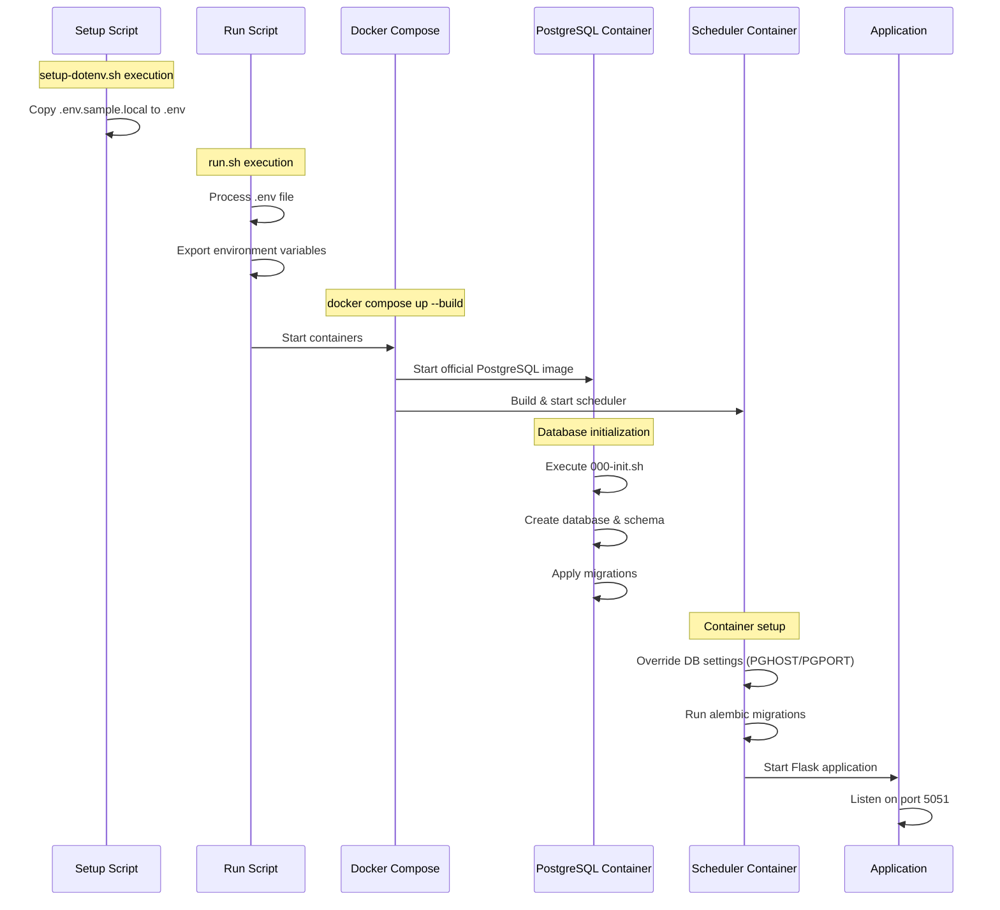
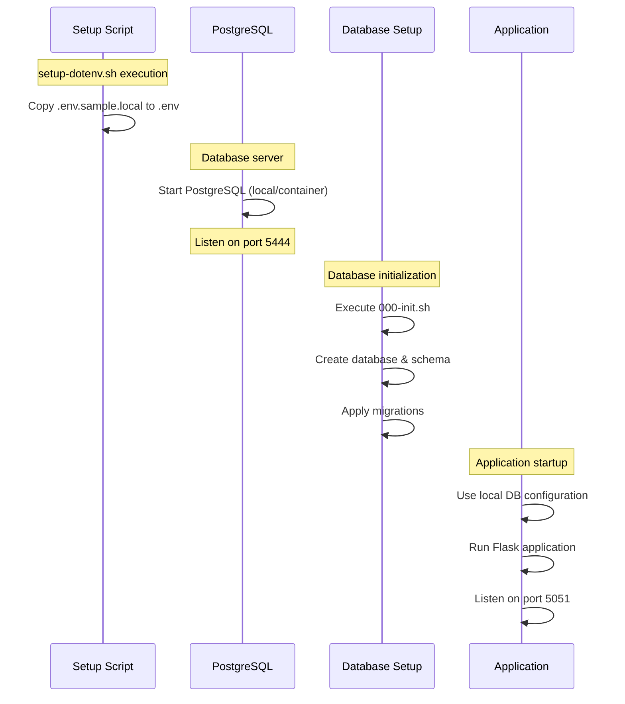

# Scheduler Application Summary

## Overview

This document provides a comprehensive overview of the Scheduler application, including its setup process, architecture, and operational workflow.

## Docker Setup

```bash
# Fix permission and setup environment
chmod +x setup-dotenv.sh
./setup-dotenv.sh

# Start the application
bash run.sh
```

## Application Components

### 1. Environment Setup (`setup-dotenv.sh`)

This script handles the initial environment configuration:
- Copies `.env.sample.local` to `.env`

### 2. Environment Variable Management & Docker initialization (`run.sh`)

- Safely reads and exports environment variables
- Starts the Docker containers using `docker compose up --build`

### 3. Docker Compose Configuration

The application uses Docker Compose for container orchestration (`compose.yaml`):

#### PostgreSQL Container

- Environment configuration:
  ```yaml
  POSTGRES_USER: ${PGUSER}
  POSTGRES_PASSWORD: ${PGPASSWORD}
  POSTGRES_DB: ${PGDATABASE}
  POSTGRES_HOST: localhost
  POSTGRES_PORT: 5432
  ```

Key Design Decisions:
- Hard-coded `POSTGRES_HOST` and `POSTGRES_PORT` in compose.yaml because:
  1. The host/port are different from what is set in .env  for the local host
  2. Ensures consistency with the PostgreSQL's containers default configuration
- Uses Postgres-prefixed variables to maintain compatibility with official PostgreSQL image

Database Connection Strategy:
- For local development:
  - Applications connect to PostgreSQL on localhost:5444
  - This is configurable in .env and is simply a port mapping between the host and the container
  - The port is not set to 5432 to avoid conflict with the default postgres port
- For postgres container environment:
  - The server runs at localhost:5432 inside the container
  - This configuration only applies inside the PostgreSQL container and shouldn't be changed
- For custom deployments:
  - Users can point to their own PostgreSQL server
  - Environment variables in .env can be adjusted without code changes
  - Supports both local and remote database connections

#### Scheduler Container
- Custom build from Dockerfile
- Environment variables from .env
- Port 5051 exposed
- Volume mounts for application code and configuration
- Postgres service is hardcoded to postgres:5432 (the postgres container on the docker network)

```bash
# Set in entrypoint.sh
export PGPORT=5432
export PGHOST=postgres
```

Environment variables take precedence over .env in the configuration system so the application in the container always connects to the containerized postgres service

#### Local Environment
- Host: localhost
- Port: 5444 (configurable in .env)
- Allows connection to local PostgreSQL instance
- Can be modified to connect to remote instances

This dual setup means:
- Local development works seamlessly
- Container deployment works without configuration changes
- Users can point to their own PostgreSQL instances by changing environment variables
- No code changes needed between local and container environments
- Supports both development and production deployments

### 5. Database Initialization

The `000-init.sh` script handles database setup:
- Creates database if not exists
- Sets up initial DB schema (dropping the old one if requested)


Key Features:
- Works in both container and local environments:
  - Adapts to container environment automatically when run there
  - Targets containerized and natively running PostgreSQL
- Can be run multiple times safely (idempotent)
- Supports database reset with DROP_DB=true


## Application Flow

### Docker Deployment Flow



## 2. Local Development Setup

#### Prerequisites
- PostgreSQL 15
- Python with package manager (uv recommended)
- Node.js 18+ (for frontend testing)

#### Steps

1. **Install Python Dependencies**
```bash
wget -qO- https://astral.sh/uv/install.sh | sh
uv sync --all-extras
```

2. **Start PostgreSQL**
Either:
- Use existing PostgreSQL installation
- Or start with Docker:

```bash
docker run --name postgres_db \
  -e POSTGRES_PASSWORD=password \
  -e POSTGRES_USER=postgres \
  -e POSTGRES_DB=fmrif_scheduler \
  -p 5444:5432 \
  --rm \
  -v pgdata:/var/lib/postgresql/data \
  postgres:15
```

3. **Initialize Database**

```bash
# Use DROP_DB=true to reset existing database
DROP_DB=true bash sql/000-init.sh
uv run alembic upgrade head
```


4. **Start Application**
```bash
uv run flask run --host 0.0.0.0 --port 5051
```

### Local Development Flow



The key differences between Docker and local deployment:

1. **Environment Setup**
   - Docker: Variables exported through run.sh
   - Local: Direct environment configuration

2. **Database Connection**
   - Docker: Internal container network (postgres:5432)
   - Local: Localhost connection (localhost:5444)

3. **Application Configuration**
   - Docker: Container-specific overrides
   - Local: Uses .env configuration directly

4. **Initialization Process**
   - Docker: Handled by container orchestration
   - Local: Manual step-by-step setup

## Testing

### Backend Testing

Two options available:

1. **With Docker (Recommended)**
```bash
uv run pytest
```

2. **With Standalone Database**
```bash
PGHOST=localhost PGPORT=5444 PGDATABASE=scheduler_test pytest
```

### Frontend Testing

1. **Install Node.js Dependencies**
```bash
npm ci --no-optional
```

2. **Install Playwright**
```bash
npx playwright install --with-deps
```

3. **Run Tests**
```bash
npm run test
```
